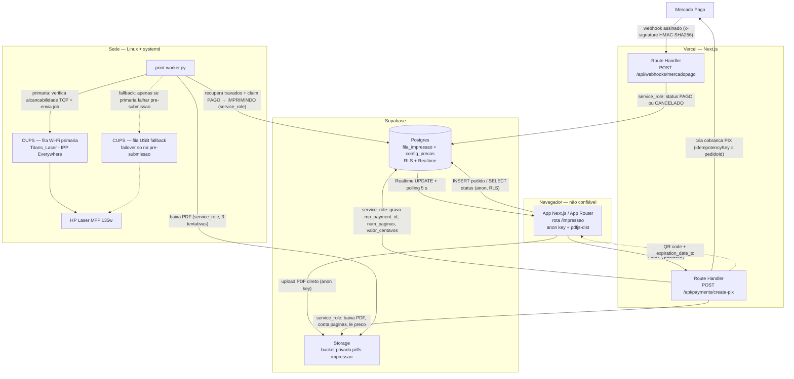
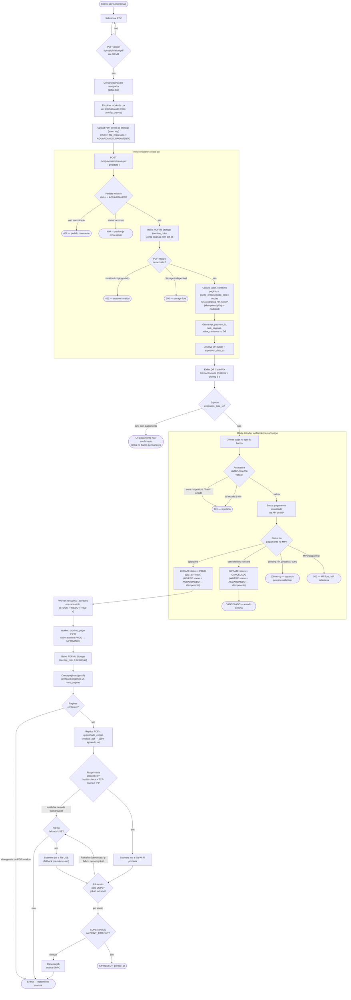
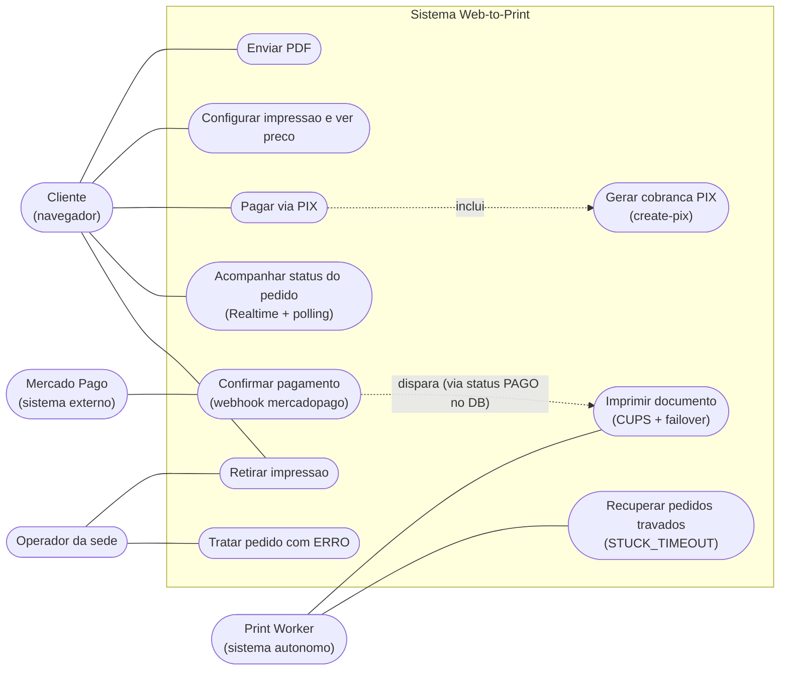
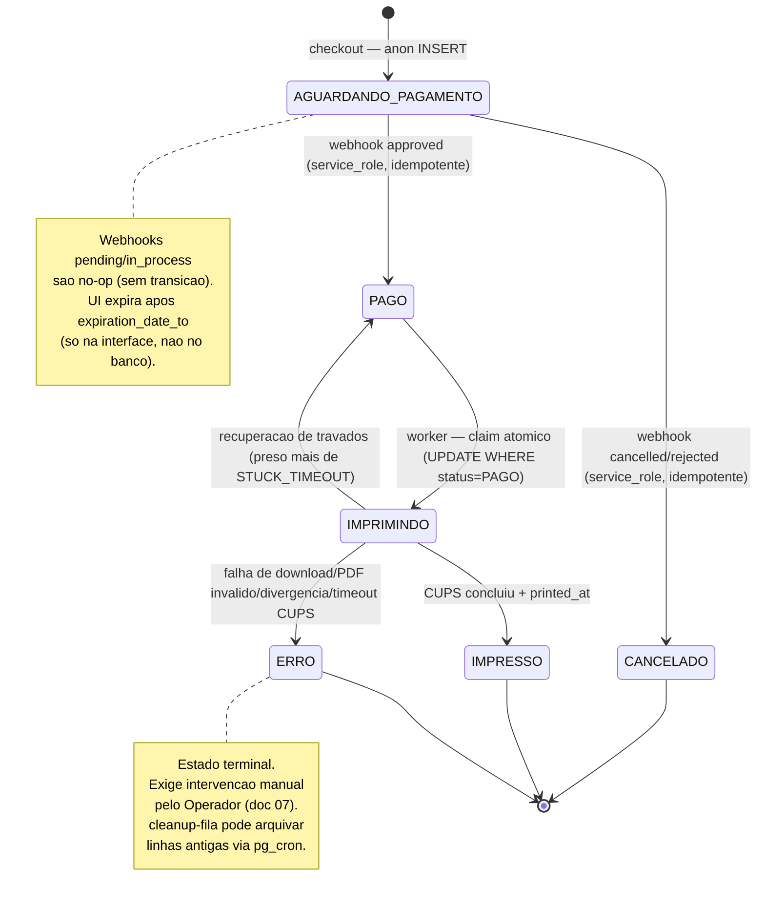

# 09 — Diagramas (UML)

[← Índice](README.md)

Visões UML da feature web-to-print, em **Mermaid** — renderizam direto no GitHub (e no VS Code
com a extensão *Markdown Preview Mermaid Support*). Os diagramas refletem o estado **atual**:
frontend e Route Handlers em **Next.js (App Router)** na Vercel, Supabase como ponto de
encontro, e o `print-worker` na sede.

> Quatro vistas: **implantação** (onde roda), **atividades** (o fluxo de um pedido), **caso de
> uso** (quem faz o quê) e a **máquina de estados** do pedido (complementa o doc
> [02](02-fluxo-pedido.md)).

---

## Diagrama de implantação

Mostra os **nós de execução** (navegador, Vercel, Supabase, sede) e os artefatos que rodam em
cada um, com os canais de comunicação e qual credencial é usada em cada aresta. É o eixo de
segurança da arquitetura: o PDF nunca passa pela Vercel, e só ambientes confiáveis têm a
`service_role`.

> **Legenda:** setas contínuas = fluxo principal; setas tracejadas = retorno de dados ou
> caminho de fallback. O PDF nunca passa pela Vercel. O failover Wi-Fi→USB só ocorre se a
> fila primária falhar **antes** de o CUPS aceitar o job (pré-submissão); após a aceitação,
> não há failover para evitar duplicação. O MP dispara notificações por dois canais
> (`notification_url` no `create-pix` + webhook do painel) — ambos chegam em RH2.

---

## Diagrama de atividades

O ciclo de vida de um pedido, do upload à impressão, com os pontos de decisão e os desvios de
exceção (PDF inválido, assinatura inválida, expiração do PIX, falha de impressão). As
atividades atravessam quatro responsáveis: **cliente/navegador**, **Route Handlers**,
**Mercado Pago** e **worker da sede**.

> **Legenda:** o diagrama segue as quatro responsabilidades: navegador (branco), Route
> Handler `create-pix` (subgrafo SRV), Route Handler `webhook` (subgrafo WH) e worker da
> sede. A expiração da UI usa `expiration_date_to` retornado pelo servidor (não um timer
> fixo de 30 min). O failover Wi-Fi→USB só ocorre na fase de pré-submissão; após o CUPS
> aceitar o job, não há failover (risco de duplicação).

---

## Diagrama de caso de uso

Os atores e o que cada um pode fazer no sistema. Note que **pagar via PIX** dispara, por
*include*, os casos internos do servidor (gerar cobrança, confirmar pagamento, imprimir) — o
cliente nunca os executa diretamente.

> **Legenda:** setas sólidas = associação direta ator-caso-de-uso. Setas tracejadas marcam
> relações de disparo/include. O Worker é um ator de sistema autônomo (não humano); o MP é
> um ator externo que aciona o webhook. `UC7` e `UC8` são exclusivos do Worker.
> `UC10` (tratar ERRO) é responsabilidade do Operador — ver
> [07 — Operação](07-operacao.md).

---

## Máquina de estados do pedido (complemento)

A coluna `fila_impressao.status` é o único ponto de coordenação entre os subsistemas. Versão
renderizável do diagrama em ASCII do doc [02](02-fluxo-pedido.md).

> **Legenda:** a coluna `fila_impressao.status` é o único ponto de coordenação entre
> navegador, Vercel e worker. Todas as transições após `AGUARDANDO_PAGAMENTO` usam
> `service_role` (bypassa RLS). A transição `IMPRIMINDO → PAGO` é a recuperação de
> travados: o worker detecta pedidos presos além de `STUCK_TIMEOUT` e os re-fila para nova
> tentativa.

---

Anterior: [08 — Segurança](08-seguranca.md) · [↑ Índice](README.md)
